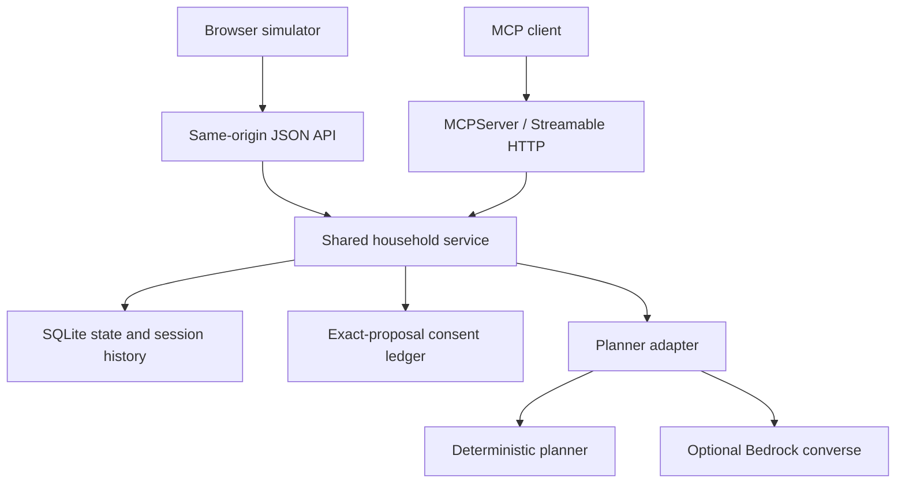

# HestiaRelay

**A persistent Alexa+ household continuity agent that carries goals across sessions, orchestrates low-risk household work, and stops at consent gates before sensitive actions.**

HestiaRelay is being built for the **Alexa+ track** of the 2026 Amazon Developer Hackathon, with parallel eligibility targets for the **AWS Builder** and **Open Source** mini challenges.

[Published demonstration — 1:28, English captions](https://www.youtube.com/watch?v=_YTQcGxBMrA).
YouTube publication is confirmed. The owner reports complete signed-out playback
in Brave with readable English text. The hosted automated check was blocked by
YouTube; [separate playback evidence and limits](docs/VIDEO_PUBLICATION.md).

## Core scenario

> “We’re having six people over Friday evening, budget $120.”

HestiaRelay turns that intent into a durable household workflow: guest count, budget, preferences, reminders, preparation tasks, and proposed purchases remain available across later sessions. Low-risk planning can continue automatically; sensitive operations are surfaced as explicit approval gates.

A follow-up session can add context such as:

> “Remember Ana is allergic to nuts.”

A later session can ask:

> “Are we ready for Friday?”

The goal is continuity, not another single-turn chatbot.

## Hackathon compliance targets

- **Primary track:** Alexa+
- **Runtime surface:** self-hosted MCP server using **Streamable HTTP**
- **MCP requirement:** compatible with the hackathon minimum specification baseline **2025-11-25**
- **AWS Builder target:** demonstrated Amazon Bedrock runtime; AgentCore/Strands remain optional evaluations
- **Open Source target:** public repository with MIT license and hackathon-window contribution history
- **Submission language:** English

## Run the three-session simulator

```bash
python -m pip install -e ".[dev]"
python -m hestiarelay.server
```

Open `http://127.0.0.1:8000/`. Click **Make a plan**, **Add what matters**, then
**Bring it all together**. Each click starts a distinct session and sends only
that session's new message. SQLite restores the goal, budget, guest constraints,
checklist, transcript, planner provenance and proposal decisions. Reloading the
browser or restarting the server with the same database preserves the thread.

This is a **guided, text-based Alexa+ experience simulation**, not a live Alexa+
connection or a general natural-language assistant. You can vary counts, dates,
budgets and preferences using the supported example sentence patterns. Use
fictional details only. Approval records consent for one exact proposal; no
purchase, payment, message or external-account action is executed.

## Implemented architecture



The browser uses the same service and engine as MCP. The transport remains a
real `MCPServer` at `/mcp`; the UI is not a mock of the backend. AgentCore and
Strands are not integrated. Public deployment and multi-household authentication
remain separate gates.

## MCP tools

The initial MCP server exposes bounded tools for:

- starting or updating a household goal;
- remembering a household preference;
- retrieving a continuity brief across sessions;
- generating and persisting a plan with Bedrock when configured, with explicit deterministic fallback on configuration or AWS failure;
- proposing a household action;
- approving or rejecting sensitive proposals;
- opening a simulator session and submitting a guided message through the same service as the UI.

No tool accepts arbitrary shell commands. Purchase-like or external-account actions are proposals only until explicitly approved, and the bootstrap does not perform a real purchase.

## Local setup

For Docker and a cloud-runner verification path, see the
[container judge guide](docs/CONTAINER_GUIDE.md). The container CI result is
reported separately from the existing Python and AWS proof evidence.
For optional authenticated judge mode and verified SQLite backup/restore, see
the [judge access guide](docs/JUDGE_ACCESS_GUIDE.md). Local MCP remains available;
remote MCP authorization and public hosting are separate gates.

Requirements:

- Python 3.12+
- Git

```bash
git clone https://github.com/Elinfiny/HestiaRelay.git
cd HestiaRelay
python -m venv .venv
```

Activate the environment and install:

```bash
# Windows PowerShell
.\.venv\Scripts\Activate.ps1

# macOS/Linux
source .venv/bin/activate

python -m pip install -e ".[dev]"
```

Run the MCP server:

```bash
python -m hestiarelay.server
```

The Streamable HTTP MCP endpoint is available at:

```text
http://127.0.0.1:8000/mcp
```

A plain health endpoint is also exposed at `/health`.

## Optional Amazon Bedrock runtime

Set a model ID and AWS region before launching the server:

```bash
# Windows PowerShell
$env:HESTIA_BEDROCK_MODEL_ID="<your-enabled-bedrock-model-id>"
$env:AWS_REGION="us-east-1"

# macOS/Linux
export HESTIA_BEDROCK_MODEL_ID="<your-enabled-bedrock-model-id>"
export AWS_REGION="us-east-1"
```

Normal AWS credential resolution is used by boto3. Credentials must never be committed to this repository.

## Validation

```bash
ruff check .
pytest --cov=hestiarelay --cov-report=term-missing
```

GitHub Actions runs these checks on PRs and main, plus Chromium at 1440×1000
and 390×844. The browser suite clicks through the real simulator, tests consent
and reload, and exports screenshots, traces and console-error evidence.
`tests/test_mcp_http.py` exercises a real SDK client over TCP across separate
sessions and an actual server-process restart. It prints negotiated protocol
versions; a target alone is not interoperability evidence.

See [demo and validation guide](docs/DEMO_GUIDE.md) for precise steps and limits.

## Evidence-first development

HestiaRelay keeps competition evidence in the repository from the start:

- [`docs/ARCHITECTURE.md`](docs/ARCHITECTURE.md) — product and technical boundaries
- [`docs/THREAT_MODEL.md`](docs/THREAT_MODEL.md) — consent, privacy, and execution risks
- [`docs/SCORING_MATRIX.md`](docs/SCORING_MATRIX.md) — explicit mapping to judging criteria
- [`docs/FRICTION_LOG.md`](docs/FRICTION_LOG.md) — reproducible developer-experience findings for bonus judging
- [`docs/ROADMAP.md`](docs/ROADMAP.md) — gated implementation sequence
- [`AGENTS.md`](AGENTS.md) — repository operating contract for AI-assisted development

## Status

**Continuity, MCP/container interoperability, authenticated judge mode and state recovery implemented; scoped release audit and demonstration candidate validated.**
See the [judge evidence map](docs/JUDGE_EVIDENCE_MAP.md) and
[reviewed release receipt](docs/evidence/release-20260913.json) for evidence and
remaining gates. The 87.84-second captioned video is a draft awaiting final visual approval.

**Historical live Bedrock proof verified.** One authorized Nova Micro
Converse call ran through the real repository adapter in a dedicated CodeBuild
role on 2026-09-12: 222 input tokens, 230 output tokens, 1,114.44 ms. All 83 tests
passed in AWS with 98.86% application coverage. The temporary resources were
removed after verified evidence export. See the [live evidence](docs/evidence/bedrock-20260912.json)
and [original reviewed log](docs/evidence/bedrock-20260912.log.txt).

The default simulator remains deterministic without AWS configuration. This
proof does not establish a live Alexa+ connection or a public hosted service.
[WORK_STATE](docs/WORK_STATE.md) tracks delivery gates and the next deployment
package; [AWS_RUNBOOK](docs/AWS_RUNBOOK.md) preserves the controlled execution path.

## License

MIT — see [`LICENSE`](LICENSE).
